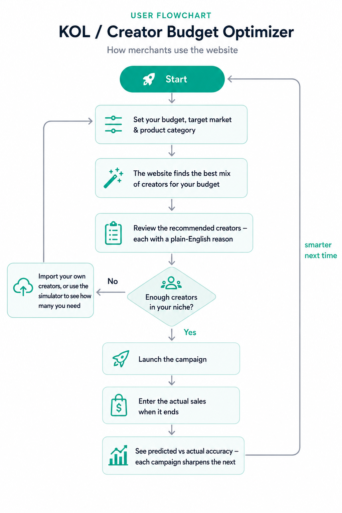

# 🎯 TikTok Shop KOL Matrix Optimizer

**Turn a fixed influencer budget into the highest-GMV creator portfolio — powered by six competing optimization algorithms, explainable AI, and a closed-loop that self-calibrates predictions from real campaign results.**

[](https://github.com/Hedy12130102/tiktok-kol-optimizer/actions/workflows/ci.yml)


For Southeast-Asia TikTok Shop merchants and agencies who must allocate a marketing budget across hundreds of creators — and **prove the ROI afterwards**. The system filters the creator pool by market and category, compares **six optimization algorithms** to maximize predicted GMV, explains *why* each creator was chosen, and feeds predicted-vs-actual GMV back into the model so every campaign **automatically** sharpens the next. Each merchant works in their own isolated, login-gated tenant.

> **▶ Live demo:** `start_server.bat` (Windows) or `uvicorn backend.main:app --reload`, then open **http://localhost:8000/ui**

---

## 💡 Why It Matters

A brand with 100 candidate creators and a budget that fits 5–8 of them faces **2¹⁰⁰ possible portfolios** — far beyond spreadsheets or gut feel. And picking the single biggest influencer is usually the *wrong* move: under TikTok Shop's commission model a mega-creator is both the most expensive *and* the least cost-efficient hire. The winning play is a **mixed-tier portfolio** of micro + nano creators that no manual shortlist reliably finds.

| Without this tool | With this tool |
|---|---|
| Manual shortlists, gut feel | Six algorithms compete; the best portfolio wins |
| Overspend on one mega-KOL | Budget-optimal mixed-tier mix, every dollar inside budget |
| "Trust me" recommendations | 3+ data-driven reasons generated per creator |
| No feedback loop | Predictions self-calibrate from each campaign's real GMV |

---

## 📊 Proven Results

Reproducible benchmark — `experiments/scalability.py`, fixed **$5,000** budget, **mean of 10 seeds**:

| Creator pool N | Best algorithm | Best GMV | Hill Climber GMV | **Uplift** |
|:---:|:---|---:|---:|:---:|
| 50 | Genetic Algorithm | $41.1K | $27.6K | **+49%** |
| 100 | Genetic Algorithm | $50.1K | $27.1K | **+85%** |
| 200 | Genetic Algorithm | $61.0K | $26.0K | **+135%** |
| 500 | Genetic Algorithm | $73.5K | $24.4K | **+201%** |

Structured search beats naïve hill-climbing by **49–201%**, and the advantage *widens* as the creator pool grows — Hill Climber's GMV actually *falls* with N (it sinks its budget into a few expensive creators and never escapes) while every structured method exploits the richer pool. The Greedy Ranking baseline ties GA within ≈1% at N≥200 while running 5–25× faster. Full methodology, per-algorithm analysis, the six-algorithm execution-time comparison, and a best-algorithm-per-N selection guide: [`docs/report_draft.md`](docs/report_draft.md).

---

## 🛠 Tech Stack

| Layer | Technology |
|---|---|
| **Optimization engine** | Pure-Python implementations of Simulated Annealing, Genetic Algorithm, Tabu Search, Hill Climber, Random Search, Greedy Ranking |
| **Backend API** | FastAPI + Pydantic — 25+ typed REST endpoints, auto-generated Swagger docs |
| **Auth & multi-tenancy** | JWT (PyJWT) + `pbkdf2_sha256` (passlib); per-merchant isolated data tenants |
| **Frontend** | Single-page app (vanilla JS + Tailwind CSS), served directly by FastAPI — no separate web server |
| **Data & analytics** | NumPy; JSON persistence; CSV/Excel import (openpyxl) + export; calibrated SEA market model with actual-vs-predicted feedback |
| **Experiments** | Matplotlib figure pipeline; seeded, fully reproducible benchmarks |
| **Quality** | 128 pytest tests (isolated from production data); GitHub Actions CI on every push |

---

## Table of Contents

- [Why It Matters](#-why-it-matters)
- [Proven Results](#-proven-results)
- [Tech Stack](#-tech-stack)
- [Features](#features)
- [Algorithms](#algorithms)
- [How It Works](#how-it-works)
- [Project Structure](#project-structure)
- [Quick Start](#quick-start)
- [API Overview](#api-overview)
- [Testing](#testing)
- [Data Flow](#data-flow)
- [Why Structured Search Wins](#why-structured-search-wins-technical-deep-dive)
- [Contributing](#contributing)
- [License](#license)

---

## Features

The platform is organised into three product modules backed by two intelligence layers:

| Module | What it does | Highlights |
|---|---|---|
| 🎯 **Campaign Optimizer** | Runs six algorithms on your filtered creator pool and returns the budget-optimal portfolio | Winning portfolio · GMV/ROI benchmark · live convergence chart |
| 👥 **Creator Management** | Build, import, and curate your own KOL database | CRUD · CSV/Excel import · price backfill · metric-trend sparklines |
| 📈 **Campaign Attribution** | Closes the loop by comparing predicted vs actual GMV | Accuracy % · **self-calibrating predictions** |
| 🔐 **Merchant Accounts** | Email/password login; each merchant's data is fully isolated | JWT auth · per-tenant library & campaigns |
| 🧠 **Explainable AI** | Plain-English justification for every pick | 3+ data-driven reasons per creator |
| ⭐ **CreatorScore & Tiers** | Composite quality score + tier classification | Leaderboards · badges · ranking |

### 🎯 Campaign Optimizer

The core engine. Choose a **budget**, one or more **target markets**, and a **product category**; the backend filters the creator pool, runs all six algorithms, and surfaces the highest-GMV portfolio.

- **Inputs** — budget ($100–$20,000), any of six SEA markets (MY · ID · TH · PH · SG · VN), a product category (Beauty · Fashion · Home & Living · FMCG), and an optional random seed for reproducible runs.
- **Results** — five headline metrics (winning algorithm, predicted GMV, budget utilization, creators selected, candidate-pool size); an SVG **convergence chart** tracing all six algorithms; a side-by-side **benchmark table** (GMV + ROI, winner highlighted); and the **KOL matrix** — one card per selected creator showing tier, reach, cost, engagement, fit, estimated GMV, and a **"Why?"** explainer.
- **Save** any result as a named campaign for later attribution.
- **Creator Pool Simulator** — a planning tool (Technical view) that simulates achievable GMV as a *synthetic* creator pool grows and reports roughly **how many creators you'd need to hit a target GMV**, motivating when to import more into your real library.

### 👥 Creator Management

Bring your own creators or curate the seeded dataset. The default seed library is built from **real FastMoss exports** (six SEA markets), with thin market×category slices topped up by clearly-labelled synthetic creators so every filter combination is usable.

- **CRUD + bulk operations** — add via a 12-field form, **import from CSV *or* Excel** (FastMoss-friendly: flexible header aliases, `250K`/`8%`/`$1,200` parsing, country/category inferred from the file name), export, inline edit/delete, filter by country/category/tier (paginated).
- **Pricing provenance & backfill** — when a source has no rate card, cost is estimated from follower tier and flagged with an **`est.` badge**; merchants replace estimates with real quotes in bulk via **Backfill Prices** (match by id / TikTok URL / name) or by inline edit, which clears the flag.
- **Source labelling** — synthetic seed-fill creators carry a **`DEMO` badge** so real (imported) and sample creators are distinguishable at a glance.
- **Seed restore** — a double-confirmed **Reset** restores the curated seed baseline (not an empty table), so merchants can experiment freely and snap back.
- **Metric trends** — each creator has a detail view with sparkline history for engagement, fit, and followers (↑/↓ trend arrows). **Simulate Update** applies realistic random drift to preview how a live TikTok-API refresh would move the numbers.
- **Roadmap connectors** — stubs for the TikTok Creator Marketplace API, TikTok Shop Partner API, and third-party analytics; "Coming Soon" cards capture early-access interest.

### 📈 Campaign Attribution & Self-Calibration

Turn one-shot predictions into a true feedback loop. Save an optimization as a campaign, then after it runs record the **actual GMV** — the system computes `accuracy % = actual / predicted × 100` and renders a predicted-vs-actual breakdown per creator.

Crucially, those outcomes **feed back into future predictions**. Each completed campaign updates a per-merchant calibration table (EWMA + shrinkage) at three resolutions, each refining the coarser one:

- **Global** — overall systematic over/under-prediction bias.
- **Segment** — per `category × country` (where the model's CTR/CVR/AOV tables live).
- **Creator** — from the per-creator actual-vs-predicted breakdown, so a creator who consistently over- or under-delivers gets an individual correction.

A `GET /calibration` endpoint and a Campaigns-page banner show the current adjustment (e.g. *"calibrated from 4 campaigns — forecasts adjusted −12%"*). With no history, every factor is `1.0` — the raw model. The recommendation *ranking* is never affected (the solver's objective stays raw); only the displayed GMV self-corrects toward your real results.

### 🔐 Merchant Accounts & Data Isolation

Each merchant registers with email + password (hashed with `pbkdf2_sha256`) and works in a **fully isolated tenant**: their own creator library, campaigns, history, and calibration live under `data/tenants/{id}/`, seeded from the curated baseline on signup. Every data endpoint requires a **JWT** bearer token (`/auth/register`, `/auth/login`); the single-page app gates the console behind a login screen and attaches the token to every request.

### 🧠 Explainable AI

No black boxes: every recommended creator ships with **3+ human-readable reasons** generated from its own data — for example:

> "Malaysia audience match is 92%, well above the 80% threshold" · "Engagement rate 15.0% is 87% above the beauty category average" · "Predicted ROI is 45% above the pool average — high cost-effectiveness"

### ⭐ CreatorScore & Tier Classification

Each creator gets a composite quality score in [0, 1] — used for leaderboards, badges, and reason generation:

```
CreatorScore = 0.30 × norm(followers)
             + 0.30 × engagement_rate
             + 0.20 × fit_score
             + 0.20 × norm(expected_gmv / cost)
```

…and a **tier** derived from follower count:

| Tier | Followers | Profile |
|------|-----------|---------|
| Mega  | > 1,000,000 | Maximum brand awareness, highest cost |
| Macro | 100,000 – 1,000,000 | Broad reach with credibility |
| Micro | 10,000 – 100,000 | Highest conversion, precise targeting |
| Nano  | < 10,000 | Niche communities, lowest cost |

The optimizer deliberately favours a **mixed-tier portfolio** over a single Mega creator — precisely where structured search beats naïve hill-climbing (see [Proven Results](#-proven-results)).

---

## Algorithms

All six solvers operate on the same binary-selection problem (each KOL is in or out, subject to the budget) and the same fitness function (`−GMV + budget_penalty + overlap_penalty`). They differ in *how* they search the 2ᴺ portfolio space:

| Algorithm | Class | Determinism | Per-run speed | Role |
|---|---|---|---|---|
| **Genetic Algorithm** | Population metaheuristic | Stochastic | Slow | Best quality at large pools |
| **Greedy Ranking** | Constructive + 2-opt local search | Deterministic | **Fastest** | Near-best & instant; interactive default |
| **Tabu Search** | Memory-based local search | Mostly deterministic | Medium (O(N²)) | Strong for N ≤ 100 |
| **Simulated Annealing** | Trajectory metaheuristic | Stochastic | Slowest | Robust escape from local optima |
| **Random Search** | Unstructured sampling | Stochastic | Fast | Lower-bound baseline |
| **Hill Climber** | Naïve local search | Stochastic | Fast | Control baseline (the "trap") |

> Benchmarked quality and runtime across N = 50–500 are in [Proven Results](#-proven-results); the mechanism behind the gap is in [Why Structured Search Wins](#why-structured-search-wins-technical-deep-dive).

### Simulated Annealing (Primary Solver)

Models the physical process of metal cooling. Starts with high temperature (accepts random moves) and gradually cools (becomes selective).

- **Neighbourhood:** Thermal-adaptive hybrid — single bit-flip, structural swap (drop one selected / add one unselected), and occasional multi-swap jumps.
- **Acceptance:** Worse solutions accepted with probability `P = e^(-delta/T)`.
- **Parameters:** T0=15,000, T_min=10, alpha=0.95, 150 iterations per temperature step (~143 temperature levels).
- **Advantage:** Escapes local optima by accepting temporarily worse portfolios.

### Hill Climber

Greedy local search. Only accepts improvements. Fast convergence but gets trapped when expensive KOLs fill the budget.

### Random Search (Lower Bound)

Pure random sampling. Demonstrates that structured search significantly outperforms random selection.

### Genetic Algorithm

Population-based evolutionary search.

- **Population:** 60 individuals over 120 generations; first individual is the multi-strategy greedy seed (the better of a GMV-descending and a GMV/cost-ratio-descending fill), the rest are randomly seeded at a budget-aware inclusion probability.
- **Selection:** Tournament selection (k=3).
- **Crossover:** Single-point crossover (probability 0.9). Budget feasibility is enforced by the fitness penalty rather than explicit repair, so over-budget children are culled by selection.
- **Mutation:** Bit-flip with probability 1/n per gene.
- **Elitism:** The best individual always survives into the next generation.
- **Advantage:** Diverse population avoids premature convergence; crossover creates genuinely novel portfolios.

### Tabu Search

Multi-strategy-greedy-initialized deterministic local search with short-term memory.

- **Tabu tenure:** 8 iterations — recently flipped indices are forbidden.
- **Aspiration criterion:** A tabu move is allowed if it produces a new global best.
- **Advantage:** Systematically explores the neighbourhood without cycling; stronger than basic HC on large pools.

### Greedy Ranking (Deterministic Constructive Solver)

Builds the better (by fitness) of a GMV-descending and a GMV/cost-ratio-descending greedy fill, then polishes it with a 2-opt swap / ADD / drop local search. Trying both orderings is the knapsack guard that stops ratio-greedy from wasting the budget on many small, overlapping creators on skewed pools. Instant and deterministic — the strongest constructive heuristic in the suite.

---

## How It Works

From the merchant's point of view, the whole tool is a handful of simple steps with one feedback loop — set a budget, let the app pick the best mix of creators, review the reasons, launch, then record real sales so each campaign sharpens the next.

<p align="center">
  
</p>

---

## Project Structure

```
tiktok-kol-optimizer/
├── backend/
│   ├── main.py              # FastAPI: /optimize, /kols, /kol/{id}, /top-kols, /simulate-scale,
│   │                        #          /calibration, /api/connections (integration stubs)
│   ├── auth.py              # JWT auth: /auth/register, /auth/login, /auth/me; require_tenant dep
│   ├── tenancy.py           # Per-tenant data paths + provisioning (data/tenants/{id}/)
│   ├── calibration.py       # Self-calibration: actual→predicted feedback (global/segment/creator)
│   ├── crud.py              # KOL CRUD: /kols/add, PUT, DELETE, /import, /backfill-costs, /reset
│   │                        # also: GET /kols/{id}/history, POST /kols/{id}/simulate-update
│   ├── campaigns.py         # Campaign Attribution: POST/GET/PUT/DELETE /campaigns
│   └── README.md            # API usage guide with curl examples
├── frontend/
│   └── index.html           # Single-page app: Optimizer + Creators + Campaigns
├── engine/
│   ├── models.py            # KOL dataclass + tier property
│   ├── fitness.py           # Fitness function + budget penalty
│   ├── optimization/
│   │   ├── simulated_annealing.py
│   │   ├── hill_climber.py
│   │   ├── random_search.py
│   │   ├── genetic_algorithm.py
│   │   ├── tabu_search.py
│   │   └── greedy_ranking.py
│   ├── scoring/
│   │   ├── creator_score.py # Weighted composite score
│   │   ├── explainer.py     # Why-recommended reason generator
│   │   └── roi_predictor.py # Predicted GMV and ROI calculator
│   └── evaluation/
│       ├── benchmark.py     # Multi-algorithm comparison runner (all 6 algorithms)
│       └── sensitivity.py   # SA parameter sensitivity analysis
├── data/
│   ├── generator.py         # Synthetic KOL generator + per-slice fill helper
│   ├── build_seed.py        # Build the seed library from real CSV/Excel exports
│   ├── fill_slices.py       # Top up thin market×category slices with synthetic fill
│   ├── sample_kols.json     # Active KOL database (real FastMoss seed + synthetic fill)
│   ├── seed_kols.json       # Restore baseline that /kols/reset returns to
│   ├── kol_history.json     # KOL metric snapshots over time
│   ├── campaigns.json       # Saved campaign attribution records
│   └── fastmoss/            # Raw + normalized FastMoss exports the seed is built from
├── experiments/
│   ├── run_comparison.py    # Convergence curve experiment (6 algorithms)
│   ├── scalability.py       # N=50 to 500 scaling benchmark (6 algorithms)
│   └── gen_figures.py       # Generates convergence / comparison charts
├── tests/
│   ├── conftest.py          # Isolates tests onto a throwaway data dir (env-path override)
│   ├── test_fitness.py
│   ├── test_algorithms.py
│   ├── test_scoring.py
│   ├── test_api.py          # Core endpoint tests (optimize, simulate-scale, reset)
│   ├── test_campaigns.py    # Campaign attribution endpoint tests
│   └── test_kol_history.py  # KOL history & simulate-update tests
├── docs/
│   ├── API_SPEC.md          # Complete API contract
│   ├── data_source.md       # Data design documentation
│   ├── report_draft.md      # Academic report draft
│   └── figures/             # Experiment charts for report
├── start_server.bat         # One-click Windows startup script
├── requirements.txt
└── README.md
```

---

## Quick Start

### Prerequisites

- **Python 3.10+**
- pip (and, optionally, a virtual environment)

### 1. Install dependencies

```bash
git clone https://github.com/Hedy12130102/tiktok-kol-optimizer.git
cd tiktok-kol-optimizer
pip install -r requirements.txt
```

### 2. Generate / build the seed data (optional)

A ready-to-use `data/sample_kols.json` (real FastMoss seed + synthetic slice fill) ships with the repo, so this step is only needed to rebuild or resize the pool:

```bash
# Option A — purely synthetic pool
python data/generator.py              # 300 KOLs (default)
python data/generator.py --num 500 --seed 7   # reproducible custom size

# Option B — build the seed from your own real CSV/Excel exports, then
# top up thin market×category slices with labelled synthetic creators
python data/build_seed.py data/fastmoss/normalized/creators_*.xlsx
python data/fill_slices.py --min 15
```

### 3. Start the backend

```bash
# Windows (double-click or run in terminal)
start_server.bat

# macOS / Linux
uvicorn backend.main:app --reload
```

For production, set a `JWT_SECRET` env var (a dev fallback is used otherwise).

### 4. Open the app

| URL | Purpose |
|---|---|
| http://localhost:8000/ui | Web application (Optimizer · Creators · Campaigns) |
| http://localhost:8000/docs | Interactive Swagger API docs |

On first use, **Create an account** (Launch Console → *Create one*). Each merchant starts from the curated seed library in their own isolated tenant.

---

## API Overview

Full specification: [`docs/API_SPEC.md`](docs/API_SPEC.md). All data endpoints require a `Authorization: Bearer <jwt>` header; `/health` and `/auth/*` are open.

### Auth

| Method | Endpoint | Description |
|--------|----------|-------------|
| `POST` | `/auth/register` | Create a merchant account + isolated tenant, return a JWT |
| `POST` | `/auth/login` | Verify credentials, return a JWT |
| `GET` | `/auth/me` | Current account / tenant |

### Core Optimization

| Method | Endpoint | Description |
|--------|----------|-------------|
| `GET` | `/health` | Health check |
| `POST` | `/optimize` | Run 6 algorithms, return best KOL matrix |
| `GET` | `/kols` | Filtered and paginated KOL list |
| `GET` | `/kol/{id}` | Single KOL detail + scores + reasons |
| `GET` | `/top-kols` | Top 10 by CreatorScore |
| `POST` | `/simulate-scale` | Creator Pool Simulator — synthetic GMV-vs-pool-size curve + "creators needed to hit target GMV" |
| `GET` | `/calibration` | Current self-calibration factors (from completed campaigns) |

### Creator Management

| Method | Endpoint | Description |
|--------|----------|-------------|
| `POST` | `/kols/add` | Add a single creator |
| `PUT` | `/kols/{id}` | Update a creator (auto-snapshots metrics; a manual cost clears the estimate flag) |
| `DELETE` | `/kols/{id}` | Delete a creator |
| `POST` | `/kols/import` (`/kols/import-csv`) | Bulk import from CSV **or Excel** (FastMoss-friendly) |
| `POST` | `/kols/backfill-costs` | Bulk-replace estimated prices with real quotes |
| `POST` | `/kols/reset` | Restore the curated seed baseline |
| `GET` | `/kols/template` · `/kols/template-excel` | Download a CSV / Excel import template |
| `GET` | `/kols/export` | Export all creators as CSV |

### KOL History Tracking

| Method | Endpoint | Description |
|--------|----------|-------------|
| `GET` | `/kols/{id}/history` | Get metric snapshots (newest first) |
| `POST` | `/kols/{id}/simulate-update` | Apply random metric drift + record snapshot |

### Campaign Attribution

| Method | Endpoint | Description |
|--------|----------|-------------|
| `POST` | `/campaigns` | Save optimization result as campaign |
| `GET` | `/campaigns` | List all campaigns |
| `GET` | `/campaigns/{id}` | Single campaign detail |
| `PUT` | `/campaigns/{id}/actual` | Record actual GMV after campaign ends |
| `DELETE` | `/campaigns/{id}` | Delete a campaign |

### API Integrations (Stubs)

| Method | Endpoint | Description |
|--------|----------|-------------|
| `GET` | `/api/connections` | List all integration statuses |
| `POST` | `/api/connections/interest` | Register early-access email for a Coming Soon integration |
| `POST` | `/api/connections/connect` | Connect an integration (returns `coming_soon` until live) |

---

## Testing

The suite has **128 tests** covering the fitness function, all six algorithms, scoring/explainer logic, and every API endpoint (optimization, the Creator Pool Simulator, CRUD, KOL history, campaign attribution, **auth & per-tenant isolation, and prediction calibration**). Tests run against an isolated throwaway tenant (`tests/conftest.py`), so the suite never mutates production data.

```bash
# Run the full suite
pytest tests/ --tb=short

# With coverage
pytest tests/ --cov=engine --cov=backend
```

CI runs the suite on every push and pull request to `dev`/`master` via [GitHub Actions](.github/workflows/ci.yml).

---

## Data Flow

```
Merchant input (manual / CSV / Excel)
         |
   sample_kols.json  <--  build_seed.py (real FastMoss exports) + fill_slices.py (synthetic slice fill)
         |
   Filter by country + category
         |
   +----------------------------------------------------------+
   |  SA    HC    RS    GA    Tabu   Greedy Ranking           |
   |  (global) (greedy) (random) (evol.) (memory) (multi-greedy)|
   +----------------------------------------------------------+
         |
   Best algorithm selected (highest objective = GMV net of overlap; baseline excluded)
         |
   CreatorScore + Tier + Reasons enrichment
         |
   Frontend renders results
         |
   [Optional] Save as Campaign
         |
   Record actual GMV → accuracy % computed
         |
   campaigns.json (attribution history)
```

---

## Why Structured Search Wins (Technical Deep-Dive)

Hill Climber selects expensive Mega/Macro KOLs early, exhausts the budget, and gets trapped — no single-bit flip can improve the solution. Greedy Ranking (multi-strategy greedy + 2-opt), Genetic Algorithm, Tabu Search, and Simulated Annealing each avoid this trap via different mechanisms — knapsack-aware construction, population crossover, tabu memory, and temperature-driven acceptance respectively. In the reproducible benchmark (`experiments/scalability.py`, fixed budget $5,000, mean of 10 seeds), HC is the weakest method at every pool size — and is the *only* method whose GMV falls as N grows ($27.6K→$24.4K) — while the best algorithm's lead over HC widens from **+49% at N=50 to +201% at N=500**. At scale the lead is shared by GA and Greedy Ranking (GA $73.5K at N=500; GR ties GA within ≈1% at N≥200, ~$61K) versus HC's ~$24K — a ~3× gap that underscores the value of structured search for large creator pools. Greedy Ranking matches GA's quality at N≥200 while running 5–25× faster, making it the best quality-per-second default.

The three constructive/memory solvers (GR, GA, TS) share a **multi-strategy greedy seed**: they build *both* a GMV-descending and a GMV/cost-ratio-descending fill and keep the better. Ratio ordering alone maximizes ROI rather than GMV, so on a skewed pool dominated by a few big creators it wastes the budget on many small, overlapping micro-creators — on the shipped real-seed library it scored *below* even Random Search until this guard was added. The live `/optimize` recommendation also ranks algorithms by the true objective (GMV net of the audience-overlap penalty) and excludes the Random Search baseline, so the recommended portfolio is never beaten by one that simply ignores overlap. See [`docs/report_draft.md`](docs/report_draft.md) §2.3.1, §3.2 and §3.7 for the full tables and the best-algorithm-per-N guide.

---

## Contributing

Contributions are welcome. To propose a change:

1. Fork the repo and create a feature branch off `dev`.
2. Make your change and **add or update tests** — the suite must stay green (`pytest tests/`).
3. Keep the experiment figures and `docs/` in sync if you touch the engine or data model.
4. Open a pull request against `dev` with a clear description; CI must pass.

For larger ideas (new algorithms, a real TikTok data integration, multi-objective optimization), please open an issue first to discuss the design.

---

## License

Released under the **MIT License** — see [`LICENSE`](LICENSE) for the full text.

Market multipliers and distributions are calibrated from publicly available industry reports; sources are documented in [`docs/data_source.md`](docs/data_source.md).
